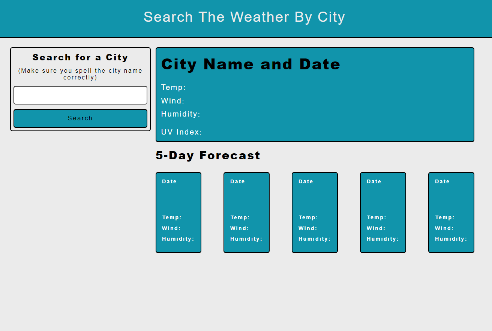

# Weather-App-Ishan-Wijesingha

## Description
This weather application displays weather information based off a city name. A user can type a city name into the searchbar on the left hand side, and once they click the search button, if the city name is spelt correctly, the weather information will be displayed on the right hand side of the webpage. 

The aqua coloured block on the top-right section of the page shows the weather information for the current day. It shows the temperature in degrees celsius, the wind speed in miles per hour, the humidity as a percentage and the UV index. It also shows the name of the city, the date, and a weather icon at the top.

Depending on the value of the UV index, a different colour will be displayed as the background of this text. The selection of colours as well as the values at which those colours are displayed were based off this credible website.
https://www.aimatmelanoma.org/melanoma-101/prevention/what-is-ultraviolet-uv-radiation/

The five aqua coloured blocks at the bottom-right section of the page is the five day forecast section. Each block represents a different date's weather information for the current city. Each block contains a date at the top, a weather icon, the temperature in degrees celsius, the wind speed in miles per hour and the humidity as a percentage.

Once the user clicks the search button, a new element is created under the search bar that contains the text which was typed into the search bar. This area serves as the search history of the user. If the user clicks one of these elements, then the input value of the search bar becomes the text content of the element that was clicked. Once that is done, the user may click the search button once more to get weather information about that city.

## Screenshot of Application

## Link to deployed application
https://ishan-wijesingha99.github.io/Weather-App-Based-Off-City/
